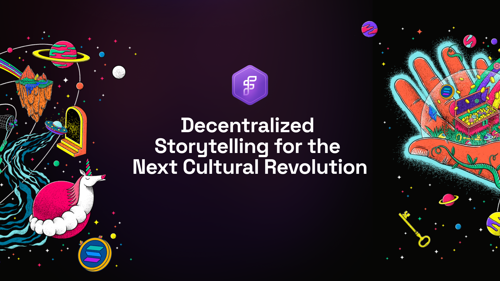
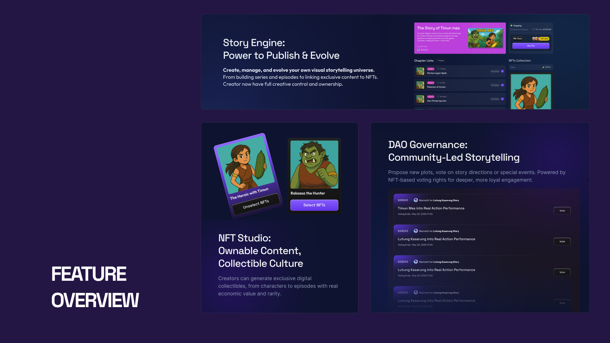

<!-- PROJECT BANNER -->
<p align="center">
  
</p>

<p align="center">
  <b>TaleDotFun</b> — The next-gen platform for collaborative storytelling, exclusive NFTs, and decentralized governance on Solana.
</p>

<p align="center">
  <a href="#features"></a>
  <a href="#tech-stack"></a>
  <a href="LICENSE"></a>
</p>

---

## 🚀 Introduction

TaleDotFun is a web3 platform that empowers creators and communities to co-create, own, and govern digital stories and collectibles. Built on Solana for speed and affordability, it blends:
- **Storytelling** (series, episodes, exclusives)
- **NFT utility** (mint, own, unlock, vote)
- **DAO governance** (proposals, voting, community-driven evolution)

---

## ✨ Features
<p align="center">
  
  <br>
  <em>Solution diagram for TaleDotFun.</em>
</p>

- **Story Program**: Create/manage series & episodes, link episodes to NFTs, manage exclusives.
- **NFT Program**: Mint exclusive NFTs, dynamic NFT utilities.
- **Governance Program**: Propose, vote, and shape the platform. Link proposals to NFTs for exclusive voting power.
- **Ownership Verification**: On-chain IPFS hash storage for authenticity.
- **Seamless Onboarding**: Solana wallet integration for web2/web3 users.
- **Decentralized & Scalable**: Built for mass adoption and community growth.

---

## 🛠️ Tech Stack
<p align="center">
  
  <br>
  <em>Tech Stack diagram for TaleDotFun.</em>
</p>

- **Solana** (Anchor, Solana CLI)
- **Metaplex** (NFTs, Candy Machine)
- **Vue.js** (PrimeVue, TailwindCSS)
- **Express.js** (API backend)
- **MongoDB** (off-chain data)
- **Pinata IPFS** (decentralized storage)
- **Vercel** (deployment)

---

## 🏗️ Architecture

<p align="center">
  
  <br>
  <em>Program Architecture diagram for TaleDotFun.</em>
</p>

---

## 💃 Why Solana?

<p align="center">
  
  <br>
  <em>Solana Integration diagram for TaleDotFun.</em>
</p>

---

## 📸 Screenshots

---

## ⚡ Quick Start

```bash
# 1. Clone the repo
$ git clone https://github.com/yourusername/taledotfun.git
$ cd taledotfun

# 2. Install dependencies
$ cd app && npm install # or yarn install
$ cd ../backend && npm install # or yarn install

# 3. Set up environment variables (see INSTALLATION.md)

# 4. Run backend
$ cd backend && npm run dev

# 5. Run frontend
$ cd ../app && npm run dev
```

For full setup, see [INSTALLATION.md](INSTALLATION.md).

---

## 📁 Folder Structure

```
TaleDotFun/
├── app/           # Frontend (Vue.js)
├── backend/       # Backend (Express.js)
├── programs/      # Solana programs (Anchor)
│   ├── tale-nft/
│   ├── tale-story/
│   └── tale-governance/
├── README.md
├── INSTALLATION.md
└── ...
```
---

## Created by TaleDotFun Team
- Alfara Nafi Dinara (Developer)
- Nisrina Thifal Khairunnisa (UI/UX Designer)
- Ramadhani Samudera Gawang Indiyanto (Developer)
- Anzalla Dzikri Dhamara (Developer)
- Inspired by the Solana, Metaplex, and DAO communities

## 📄 License

This project is licensed under the [MIT License](LICENSE).
